# OrderManager

Es una aplicación de gestión de ordenes de venta de materiales, que permite registrar, supervisar y gestionar las órdenes  llevando un control administrativo de todo el proceso de venta.

- Administración de usuarios (crear, visualizar, modificar y borrar).
- Administración de clientes (crear, visualizar, modificar y borrar).
- Administración de materiales (crear, visualizar, modificar y borrar).
- Administracion de ordenes de venta.
     - Dashboard de ordenes (gráfico por status).
     - Seguimiento de ordenes (order to cash).
     - Crear, visualizar, modificar y borrar.

---
  ## Contenido
  1. [Enlaces](#enlaces)
  2. [Tecnologias](#tecnologias)
  3. [Uso](#uso)
  4. [Instalación](#instalación)
  5. [Contribución](#contribución)
  6. [Colaboradores](#colaboradores)
  
---
## Enlaces

**[Aplicación desplegada ](https://order-manager-application.herokuapp.com/ "click")**.

**[URL de repositorio de GitHub](https://github.com/jaime-a-esquivel-a/OrderManager "click")**.

---
## Tecnologias:

- node JS versión 16.18.0
- npm express 4.17.1
- npm sequelize 6.3.5
- npm mysql2 2.2.5
- npm dotenv 8.2.0
- npm bcrypt 5.0.0
- npm connect-session-sequelize 7.0.4
- npm express-handlebars 5.2.0
- npm express-session 1.17.1
- npm handlebars 4.7.6
- chart.js
- Boostrap 5
- HTML
- Heroku

---
## Uso
  
* Ingresar a la aplicación desplegada en **[Heroku](https://order-manager-application.herokuapp.com/ "click")** o acceder desde el navegador  con la dirección [http://localhost:3001](http://localhost:3001 ) despues de haber ejecutado el archivo como muestra la sección de [Instalación](#instalación).
* Al ingresar a la aplicación es necesario iniciar sesión introduciendo credenciales (correo electrónico y contraseña) de acuerdo con el usuario con el que desee acceder y después dar click en "Login" para ingresar a la página de inicio.

  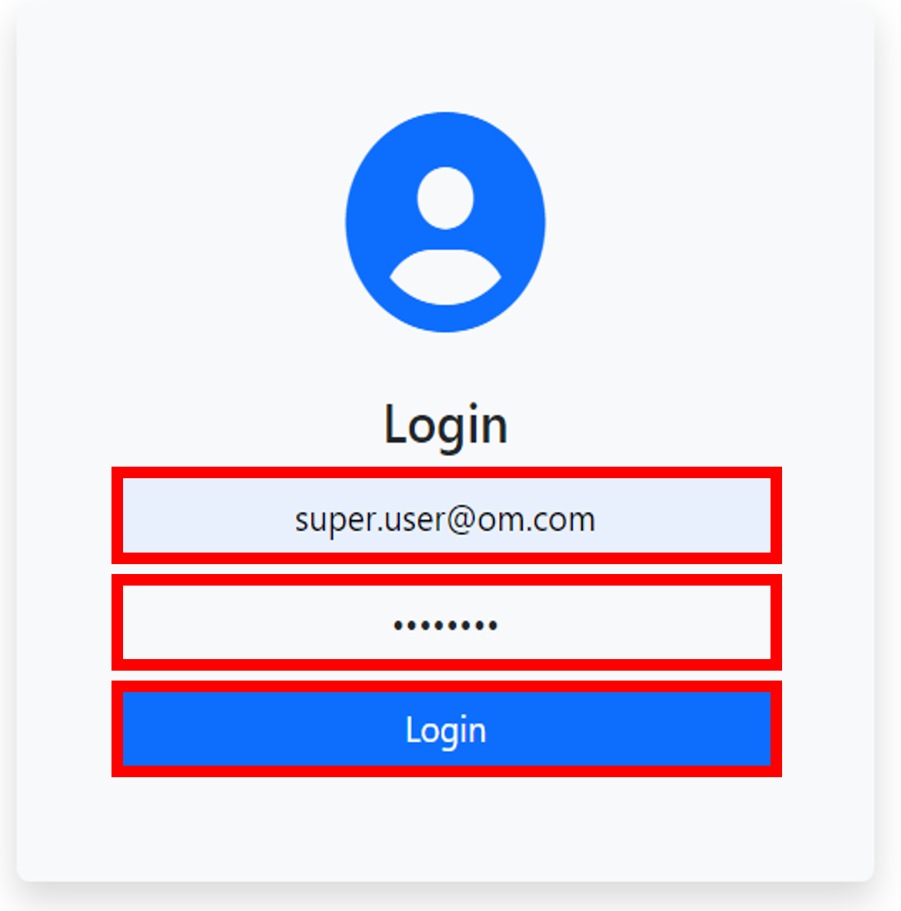
* Al ingresar a la página de inicio "Home" se le mostrará un menú con la barra de navegación de la página, una gráfica con la cantidad de órdenes del usuario que ha iniciado sesión de acuerdo a su status.

  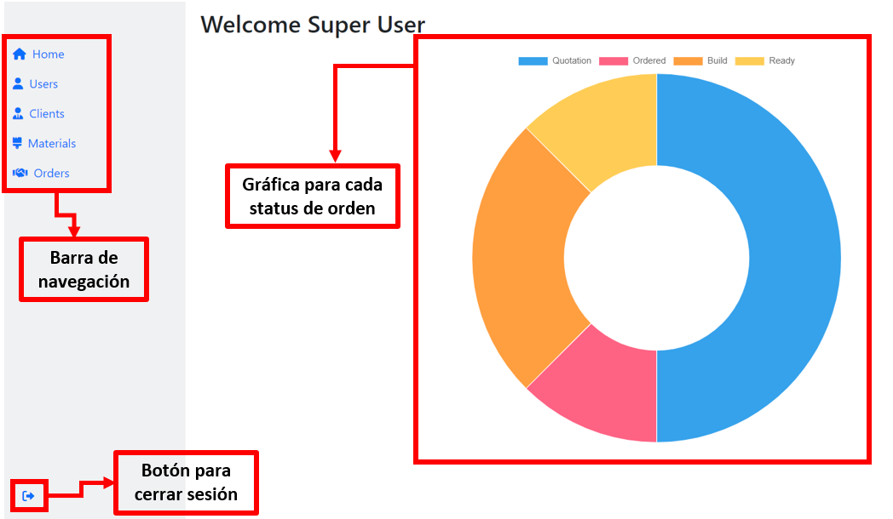
### Sección usuario
* Si ha iniciado sesión un super user, entonces podrá visualizar, actualizar y eliminar los usuarios que se encuentran en la base de datos, así como crear nuevos. De lo contrario solo podrá visualizarlos.

    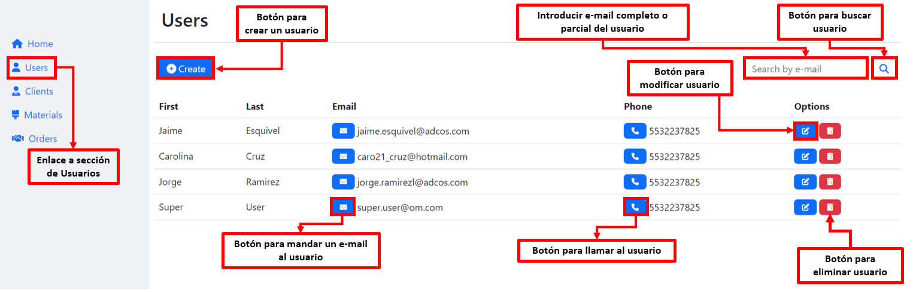
### Crear usuario
* Para crear un usuario es necesario:
    * Presionar el botón de "Create" en la sección de Usuarios.
    * Llenar toda la información de la siguiente pantalla y dar click en el botón "Submit" para crearlo.

     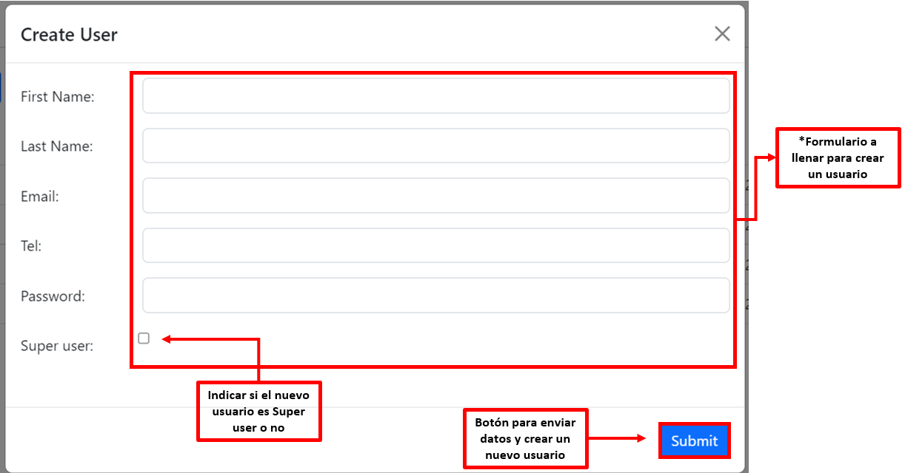
### Modificar usuario
* Para modificar un usuario es necesario:
    * Presionar el botón de "Modificar" en la sección de Usuarios.
    * Llenar la información que desea modificar de la siguiente pantalla (no será posible modificar e-mail del usuario) y dar click en el botón "Submit" para actualizarla.

    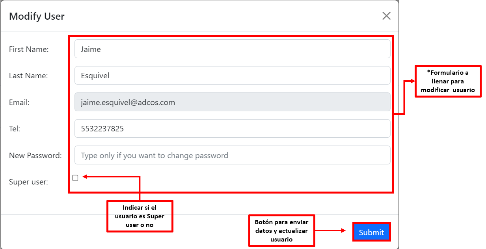

 ### Sección cliente
* Si ha iniciado sesión un super user, entonces podrá visualizar, actualizar y eliminar los clientes que se encuentran en la base de datos, así como crear nuevos. De lo contrario solo podrá visualizarlos.

    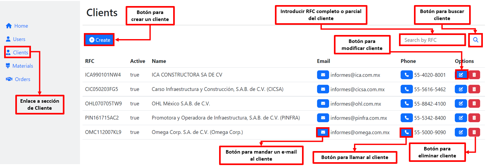
### Crear cliente
* Para crear un cliente es necesario:
    * Presionar el botón de "Create" en la seccion de Clientes.
    * Llenar toda la información de la siguiente pantalla y dar click en el botón "Submit" para crearlo.

     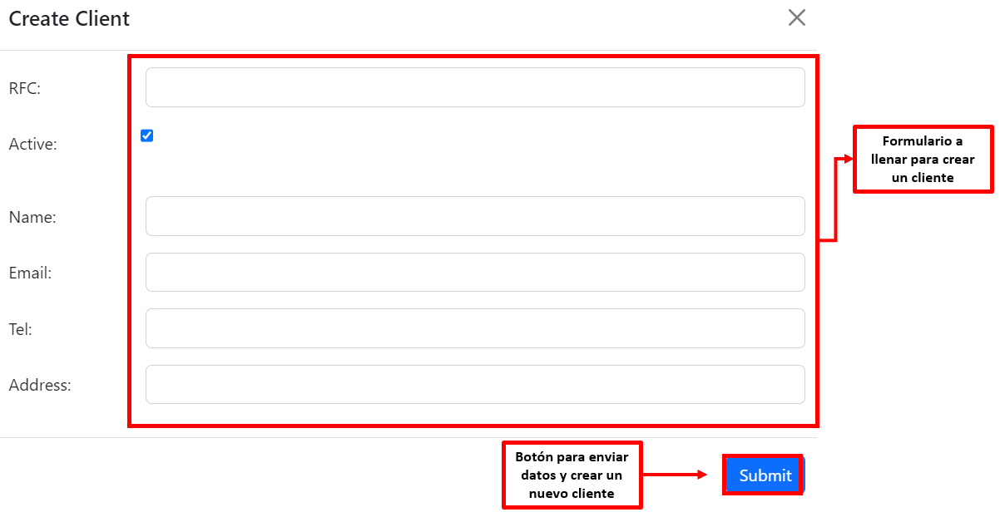
### Modificar cliente
* Para modificar un cliente es necesario:
    * Presionar el botón de "Modificar" en la seccion de ClienteS.
    * Llenar la información que desea modificar de la siguiente pantalla (no será posible modificar RFC del cliente) y dar click en el botón "Submit" para actualizarla.

    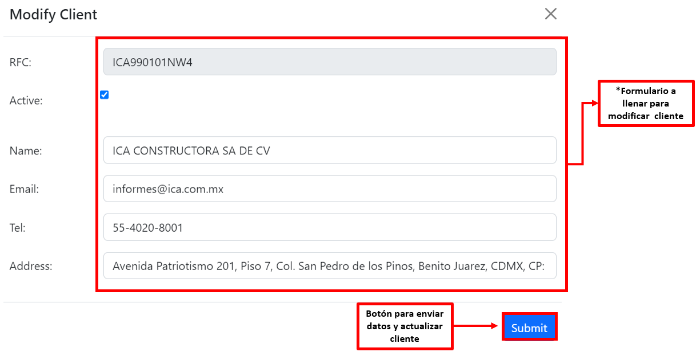

---
 ## Instalación
- Clonar repositorio
    - Abrir el siguiente link **[URL de repositorio de GitHub](https://github.com/jaime-a-esquivel-a/OrderManager "click")**.
    - Hacer click en <> Code.

        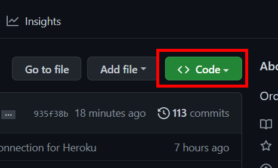
    - Copiar la direccion URL del repositorio.

        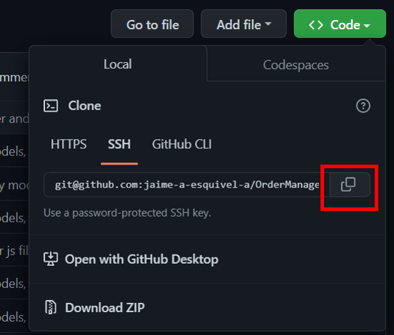
    - Abrir GitBash.
    - Ir a la ubicacion en donde quieres clonar el repositorio.
    - Escribir **`git clone`** y pegar la url antes copiada.
    - Presionar enter para clonar.

- Instalar node desde la pagina oficial **[NodeJS web Oficial](https://nodejs.org/es/ "click")**.
    - Abrir GitBash.
    - Ir a la ubicacion en donde se clonó el repositorio.
    - Escribir **`npm i`** para instalar las dependencias del proyecto.
    - Con esto instalaremos todas las dependecias que tengamos en el package.json y nos creará una carpeta llamada **node_modules** con las dependencias listas para utilizar.
     Dirijirse al archivo **`.env.example`** y agregar las siguientes variables para proteger las credenciales de la base de datos y poder conectarse.
     
            DB_NAME='nombre de la base de datos'
            DB_USER='nombre de usuario'
            DB_PASSWORD='tu contraseña de MYSQL'
        
    - Escribir **`mysql -u root -p`** para conectarse a MySQL CLI e igresar contraseña.
    - Escribir **`source schema.sql`** para crear la base de datos MySQL (Asegurarse que la ruta sea correcta).
        - #### Diagrama UML de la base de datos
            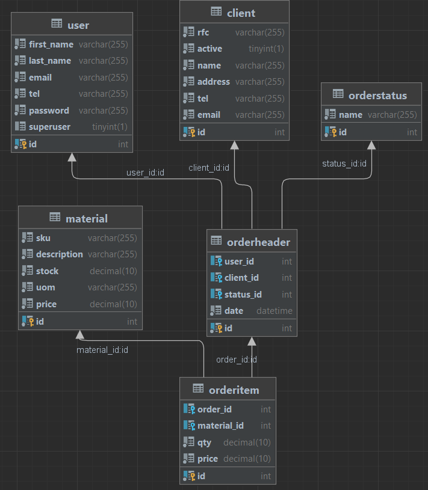

    - Escribir **`quit`** para desconectarse de MySQL CLI
    - Escribir  en la terminal GitBash **`node seeds/index.js `** para agregar datos a la base de datos y poder comprobar las rutas (opcional).
    - Escribir **`npm start`** para ejecutar el archivo.

---
## Contribución
    
  Para contribuir con este proyecto:
- Fork del repositorio.
- Clonar el  repositorio.
- Actualizar la rama master.

        $git pull -r upstream master
- Crear rama.

        $ git checkout -b feature-nombre-rama
- Realizar cambios, agregarlos, hacer commit y despues hacer push hacia nuestro repositorio indicando la rama que hemos creado.

        $ git push origin feature-nombre-rama
- Hacer un Pull Request.
- Esperar que el codigo se acepte y se haga merge.

---
## Colaboradores
    
- **[Jorge Ramirez Anzaldo](https://github.com/JorgeRamirezAnzaldo "click")**.
- **[Jaime Alberto Esquivel Acosta](https://github.com/jaime-a-esquivel-a "click")**.
- **[Diana Carolina Cruz Velázquez](https://github.com/Caro2102 "click")**.
